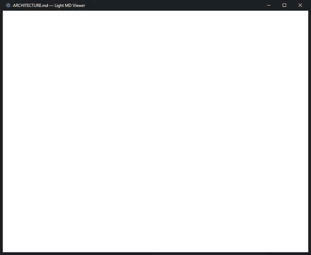
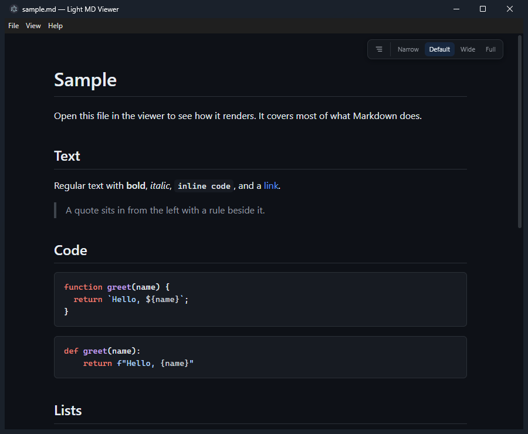

#  Light MD Viewer

A read-only Markdown viewer for Windows.



## Features

- Opens on double-click, `Ctrl+O`, or drag and drop
- Reloads when the file changes on disk, at the same scroll position
- Find in page, with a match counter
- Outline sidebar that follows the scroll
- Syntax highlighting and a copy button on code blocks
- Light or dark, following the Windows setting
- Print and export to PDF
- Remembers the window, the theme, and where you stopped reading in each file

Reads `.md`, `.markdown` and `.txt`. No editing, no tabs, no plugins, no network.



That is [`sample.md`](sample.md) from this repository.

## Shortcuts

| Key                          | Does                |
| ---------------------------- | ------------------- |
| `Ctrl+O`                     | Open a file         |
| `Ctrl+F`                     | Find in page        |
| `Ctrl+Shift+O`               | Toggle the outline  |
| `F5`                         | Reload              |
| `Ctrl+P`                     | Print               |
| `Ctrl+=`, `Ctrl+-`, `Ctrl+0` | Zoom in, out, reset |

## Install

Builds are on the [Releases page](https://github.com/chryaner/light-md-viewer/releases): an
installer, and a portable `.exe` for when you cannot install software. If that page is empty,
nothing has been published yet. Build from source below.

The binaries are not code-signed, so Windows SmartScreen warns about an unknown publisher. Every
release ships SHA-256 sums, a virus scan report and a build provenance attestation.
[SECURITY.md](SECURITY.md) has the commands to check them.

## Speed

Launch to document on screen, warm, same file, one Windows 11 machine.

| Program                   | Warm launch |
| ------------------------- | ----------- |
| Sublime Text              | 0.12 s      |
| **Light MD Viewer**       | 0.24 s      |
| Notepad                   | 0.40 s      |
| VS Code                   | 0.72 s      |
| Light MD Viewer, portable | 2.4 s       |

An empty Electron window costs about 0.25 s on that machine. The app is level with that, within
the noise of the measurement, so the number is Chromium starting and almost nothing else. The
portable build is slower because it unpacks itself into a temporary directory every time.

The download is about 95 MB, since Electron carries Chromium. The app code inside it is 286 KB.

## Build from source

Node.js 22 and npm, on Windows.

```
git clone https://github.com/chryaner/light-md-viewer.git
cd light-md-viewer
npm install
npm start
```

`npm start` opens the welcome screen. To start on a file, use `npx electron . path\to\file.md`.

| Script          | Does                                                    |
| --------------- | ------------------------------------------------------- |
| `npm run lint`  | ESLint, then Prettier                                   |
| `npm test`      | 95 unit tests                                           |
| `npm run build` | packages the installer and portable `.exe` into `dist/` |

[CONTRIBUTING.md](CONTRIBUTING.md) has the rest of the scripts.

## More

How it works: no bundler, no framework, no build step, zero runtime npm dependencies.
[docs/ARCHITECTURE.md](docs/ARCHITECTURE.md) has the module map and the security model.

Bug reports and small pull requests are welcome. See [CONTRIBUTING.md](CONTRIBUTING.md).

MIT. See [LICENSE](LICENSE).
